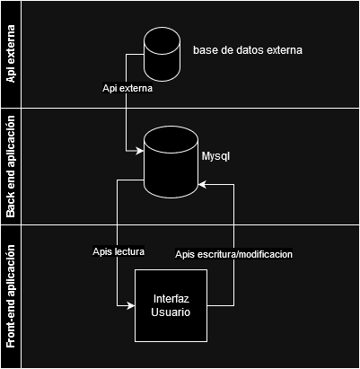

# Prueba-CRUD Usuarios

Este proyecto es una aplicación de gestión de usuarios utilizando **Laravel** para el backend y **React** para el frontend. Implementa operaciones CRUD (Crear, Leer, Actualizar, Eliminar) sobre un modelo de usuario.

## Estructura del Modelo de Usuario

El modelo de usuario utilizado en este proyecto tiene la siguiente estructura:

```json
{
  "id": 24,
  "name": "Leanne Graham",
  "username": "Bret",
  "email": "Sincere@april.biz",
  "address_city": "Kulas Light - Apt. 556 - Gwenborough -",
  "phone": "1-770-736-8031 x56442",
  "website": "hildegard.org",
  "company_name": "Romaguera-Crona",
  "company_bs": "harness real-time e-markets"
}

Se implementaron las migraciones en laravel para poder crear las tablas de la base de datos de manera sencilla.

## flujo de los datos en la aplicación




##  Flujo de peticiones de la aplicacion


# GUIA DE INSTALACION

Requisitos:

PHP >= 8.0
Composer
Node.js
Laravel >= 9.x
React >= 18.x
MySQL o cualquier otra base de datos relacional compatible con Laravel

en una consola de comandos cmd o bash ejecutar los siguientes comandos

Clonar repositorio

```
    git clone https://github.com/usuario/prueba-crud-usuarios.git
    cd prueba-crud-usuarios
```

instalacion de dependencias en laravel
```
    cd back-prueba-api/
    composer install
```

instalar dependecias en react

desde la raiz del proyecto
```
     cd crud-frontend/
     npm install
```

en el directorio back-prueba-api/ modificar el archivo ``` .envExample```, cambiar el nombre a ``` .env``` y configurar el apartade de bases de datos del archivo, con el puerto, el nombre de la base de datos y la contraseña del motor de base de datos utilizada. 

## ejecucion del proyecto

Si aun no se han creado las bases de datos mediante el script sql ejecutar las migraciones de laravel.

en la raiz del proyecto.
```
    cd back-prueba-api/
    php artisan migrate
```

Una vez la migracion esta lista se puede ejecutar el proyecto

```
    php artisan serve
```

Desde otra consola cmd o bash ejecutar el proyecto react

en la raiz del proyecto
```
    cd back-prueba-api/
    npm start
```

El pryecto deberia estar en funcionamiento.